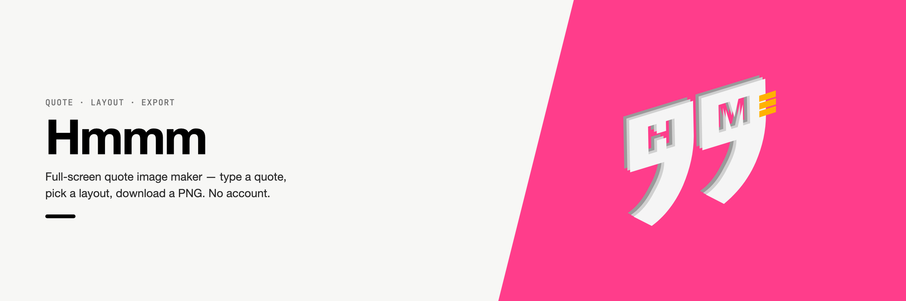

<!-- PROJECT BANNER -->
<p align="center">
  
</p>

<h1 align="center">Hmmm</h1>

<p align="center">
  <strong>Full-screen quote image maker</strong> — type a quote, pick a layout, download a PNG.<br />
  Installable PWA · no account · no backend required.
</p>

<p align="center">
  <a href="#getting-started">Getting started</a>
  ·
  <a href="#usage">Usage</a>
  ·
  <a href="#self-hosting">Self-hosting</a>
  ·
  <a href="#deep-links">Deep links</a>
  ·
  <a href="#license">License</a>
</p>

<p align="center">
  
  
  
  
  
</p>

<br />

## About

**Hmmm** is a static, privacy-friendly tool for turning quotes into shareable images. It runs entirely in the browser: write text, choose a layout and background, tweak type, and export a PNG. There is no login, no database, and no server-side image storage.

Built as an Excalidraw-style workspace (toolbar + side panel + live stage) and shippable as an installable PWA with offline support for the editor shell and gallery.

### Features

- **Quote editor** — primary text, optional translation, and author (hard cap: 300 words/units)
- **Layouts** — 1:1, 4:5, 9:16, 16:9, 2:1 with auto type-fit via [pretext](https://github.com/chenglou/pretext)
- **Backgrounds** — curated local gallery (SVG + photo packs), solids, gradients, blur, filters, scrim
- **Upload** — drag-and-drop or file picker; images stay on the device (never uploaded)
- **Typography** — curated fonts, weight, size, alignment, and colors
- **Templates** — quick-start compositions (Tpl tab)
- **Site themes** — Light, Dark, Mint, Lilac, Navy (chrome only; quote canvas is independent)
- **Export** — download a PNG of the frame
- **Deep links** — prefill from partners with `/create?q=&author=`
- **PWA** — installable, offline shell + cached backgrounds, update prompt

### Built with

| Layer | Choice |
|-------|--------|
| App shell | [Astro](https://astro.build) (static) + [Vue](https://vuejs.org) islands |
| Styles | [Tailwind CSS](https://tailwindcss.com) v4 · tokens in [DESIGN.md](./DESIGN.md) |
| Language | TypeScript |
| Tooling | [Bun](https://bun.sh) (preferred) · Node ≥ 22.12 |
| Text fit | [@chenglou/pretext](https://github.com/chenglou/pretext) |
| Export | [html-to-image](https://github.com/bubkoo/html-to-image) |
| PWA | `@vite-pwa/astro` + Workbox |
| Deploy | Vercel static · Docker / nginx · any static host |

<p align="right">(<a href="#about">back to top</a>)</p>

## Getting started

### Prerequisites

- [Bun](https://bun.sh) **or** Node.js ≥ **22.12** (npm / pnpm also work)
- For e2e tests only: Playwright Chromium (`bunx playwright install chromium`)

### Installation

```bash
git clone https://github.com/kawishbit/hmmm.git
cd hmmm

bun install
# or: npm install / pnpm install

bun run dev
```

Open the URL Astro prints (usually `http://localhost:4321`).

**Production-like local preview:**

```bash
bun run build
bun run preview
```

<p align="right">(<a href="#about">back to top</a>)</p>

## Usage

| Region | Role |
|--------|------|
| **Top toolbar** | Logo, layout, theme, share link, help, download |
| **Left panel** | **Text** · **Type** · **Bg** · **Tpl** |
| **Center stage** | Live quote frame |

### Typical flow

1. Open `/` (or `/create` from a deep link).
2. Enter quote text (and optional author / translation).
3. Pick a layout that fits the length.
4. Choose a gallery background, solid/gradient, or upload your own.
5. Adjust type, then **Download** a PNG.

### Routes

| Path | Page |
|------|------|
| `/` | Editor |
| `/create` | Editor (partner deep-link entry) |
| unknown | On-brand 404 |

### Scripts

| Command | Description |
|---------|-------------|
| `bun run dev` | Dev server (hot reload) |
| `bun run build` | Production static build → `dist/` (+ service worker) |
| `bun run preview` | Preview production build |
| `bun run check` | Astro + TypeScript checks |
| `bun run test:unit` | Unit tests (`src/**/*.test.ts`) |
| `bun run test:integration` | Build + `dist/` contract tests |
| `bun run test:e2e` | Build + Playwright browser tests |
| `bun run test:all` | Unit + integration + e2e |
| `bun run lint` | Biome lint |

<p align="right">(<a href="#about">back to top</a>)</p>

## Deep links

Prefill the editor from another site (plain text only; 300-unit cap):

```html
<a href="https://your-host.example/create?q=Stay%20hungry&amp;author=Steve%20Jobs">
  Frame this quote
</a>
```

| Param | Meaning |
|-------|---------|
| `q` | Quote text |
| `author` | Author name |

Use **Link** in the app toolbar to copy a shareable URL for the current quote.

<p align="right">(<a href="#about">back to top</a>)</p>

## Self-hosting

Hmmm is a **static** site (`dist/`). No database, no server-side API.

### Vercel

1. Import the repo in [Vercel](https://vercel.com).
2. Framework: **Other** / static (or leave auto-detect).
3. Build command: `bun run build` (see `vercel.json`).
4. Output directory: `dist`.
5. Node version: **22** (`.nvmrc` / `engines`).

Cache headers for hashed assets and the service worker are defined in `vercel.json`.

### Docker

Multi-stage image: build with Bun, serve with **nginx** (`Dockerfile`, `deploy/nginx.conf`).

```bash
docker build -t hmmm:latest .
docker run --rm -p 8080:80 hmmm:latest
# → http://localhost:8080
```

**Compose:**

```bash
docker compose up --build -d
# → http://localhost:8080

docker compose down
```

### Reverse proxy notes

- Prefer **HTTPS** in production (required for full PWA install on most mobile browsers).
- Do not long-cache `/sw.js` or `*.webmanifest` (nginx already uses `must-revalidate`).
- `/create?q=…&author=…` deep links work; `/` and `/create` are real app pages.

<p align="right">(<a href="#about">back to top</a>)</p>

## Backgrounds (zero backend)

- **Gallery** — local SVGs + photo packs (Abstract, Nature, Texture, Urban, Dark, Paper) in `public/backgrounds/`
- **Upload** — stays on the device; never sent to a server
- **No** stock photo APIs, **no** paste-image-URL (avoids CORS export issues)
- Credits: [public/backgrounds/CREDITS.md](./public/backgrounds/CREDITS.md)

## Project status

**v1.0.0** — first public release. See [CHANGELOG.md](./CHANGELOG.md).

| Phase | Focus | Status |
|-------|--------|--------|
| 0–5 | Product + PWA | Complete |
| 6 | Unit tests | Complete |
| 7 | Integration + e2e | Complete |
| 8 | Self-hosting (local / Vercel / Docker) | Complete |
| 9 | Curated local backgrounds | Complete |

Full plan: [plans/PLAN.md](./plans/PLAN.md).

### Constraints (by design)

- No login / authentication  
- No database  
- Hard cap: **300 words/units** per quote field  

## Brand assets

Logo and repository banner live under [`logos/`](./logos/):

| Asset | Path |
|-------|------|
| Banner (3:1) | [`logos/banners/banner.png`](./logos/banners/banner.png) |
| Logo (SVG / PNG) | [`logos/logo.svg`](./logos/logo.svg) · [`logos/logo.png`](./logos/logo.png) |

## License

Distributed under the **MIT** License. See [LICENSE](./LICENSE).

Background photography and textures: [public/backgrounds/CREDITS.md](./public/backgrounds/CREDITS.md).

## Acknowledgments

- [Cheng Lou — pretext](https://github.com/chenglou/pretext) for layout-aware text measurement
- [Astro](https://astro.build), [Vue](https://vuejs.org), [Tailwind CSS](https://tailwindcss.com), [Vite PWA](https://vite-pwa-org.netlify.app/)
- Design tokens and editorial system documented in [DESIGN.md](./DESIGN.md)

<p align="right">(<a href="#about">back to top</a>)</p>
